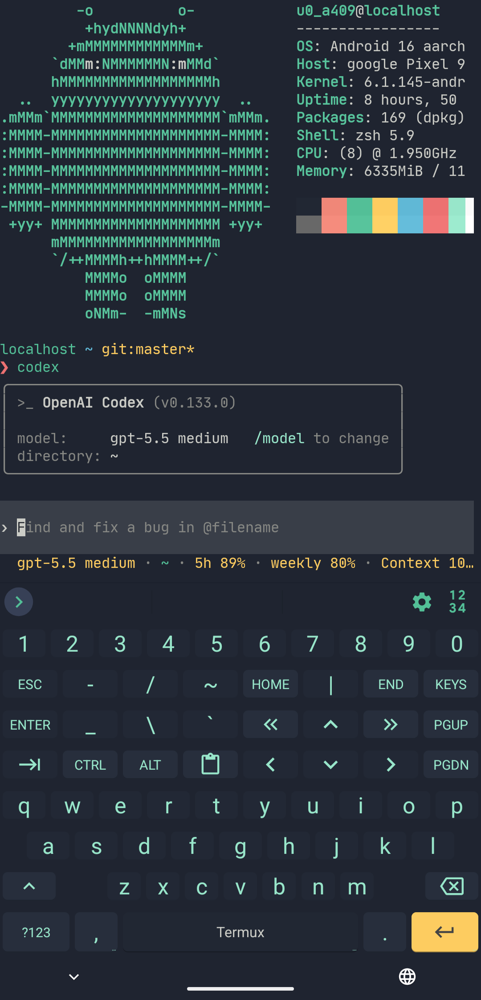

# Codex CLI + Voice for Android/Termux



Codex CLI compiled for Android/Termux with Android-native voice modes.

Status: `alpha`. The current upstream target is Codex `rust-v0.135.0`.
This release was validated on Pixel 9 and 6a, Android 16, Termux 0.118.3.
On Pixel6a, STTS Wake Word was validated with the screen off through a full
wake -> STT -> Codex -> TTS -> re-arm turn.

This repository does not vendor the upstream Codex source tree.

Codex itself requires normal Codex authentication: a ChatGPT account with Codex
access or an OpenAI API key. The `$stts` voice path does not require OpenAI
Realtime API billing. OpenAI Codex Realtime Voice requires an OpenAI API key
and uses OpenAI Realtime API billing.

## Why This Exists

Android is a natural intake surface for Codex: nearby, voice-capable,
sensor-rich, and close to the user's notes, files, notifications, and share
flows.

Termux provides the Linux command-line environment for Codex, while Termux:API
can expose Android capabilities such as dialogs, notifications, share/open
intents, clipboard, battery, location, and sensors.

This project targets native Termux rather than PRoot because Termux runs
directly on Android's host environment, without an extra distro/proot layer.
That gives CCVA lower overhead, fewer moving parts, direct Termux:API access,
and cleaner integration with Android storage, intents, widgets, and the local
audio shim. PRoot may be useful for distro compatibility and could likely
connect to the local shim, but it is not the supported audio path for this
release.

CCVA rebuilds Codex for Android/Termux, adds Android-native audio through a
local shim, and provides two voice paths:

- `$stts`: a local STTS Codex skill for half-duplex,
  walkie-talkie-like voice interaction.
- `codex-voice --allow-realtime`: OpenAI Codex CLI Realtime voice mode adapted
  for Android native audio.

Useful workflows include mobile voice intake for Codex, translating spoken user
intent into context-aware agent prompts, using a phone as an orchestrator for
other agents, maintaining on-device markdown repos or Obsidian vaults, and
building Termux:API flows.

<br clear="right">

## Voice Modes

| Mode | How to start | Cost profile | Best for |
| --- | --- | --- | --- |
| Local Android STTS | Use the `$stts` skill, `STTS: Start + Talk`, or `STTS: Wake Word` | Uses normal Codex authentication; no Realtime API billing | Walkie-talkie-like voice sessions |
| OpenAI Codex Realtime Voice | `codex-voice --allow-realtime` or `Realtime API Voice` | Uses OpenAI Realtime API billing | Codex CLI realtime voice on Android native audio |

Local Android STTS uses the Android shim `/v1/text-voice` endpoint first:
Android `TextToSpeech` for spoken output and Android `SpeechRecognizer` for
one-shot speech input. Termux:API speech commands remain fallback paths. STTS
pins Codex turns to `gpt-5.4-mini` with low reasoning by default, with
environment overrides available for testing. `STTS: Wake Word` arms a bounded
Hey Jarvis wake listener and plays its subtle cue after wake detection,
immediately before request STT starts.

OpenAI Codex Realtime Voice uses the shim `/v1/audio` endpoint for Android
native microphone/speaker routing and streams audio through the OpenAI Realtime
API. The launcher refuses to start unless Realtime billing is explicitly
allowed with `--allow-realtime` or `CODEX_VOICE_ALLOW_REALTIME=1`.

See [VOICE_MODES.md](VOICE_MODES.md) for details.

## What This Builds

- `codex`: upstream Codex CLI, cross-compiled for Termux/Android.
- `codex-api`: launcher that loads an OpenAI API key from `OPENAI_API_KEY` or
  `OPENAI_API_KEY_FILE`.
- `codex-voice`: guarded OpenAI Codex CLI Realtime voice launcher for native
  Android audio through the AEC shim.
- `codex-install-stts`: installs or updates the local `$stts` skill with
  backup.
- `codex-aec-shim-debug.apk`: Android app/service that exposes native
  capture/playback to Codex over a local WebSocket.

The Termux package installs under
`$PREFIX/libexec/codex-cli-voice-android/` and exposes launchers in
`$PREFIX/bin`.

## Launch Surfaces

After installing the package and refreshing Termux:Widget launchers, the
expected user-facing surfaces are:

- Shell: `codex`, `codex resume --last`, `codex exec`, `codex-voice
  --allow-realtime`
- Codex skill: `$stts`
- Termux:Widget shortcuts: `Codex`, `Codex Resume Last`,
  `Realtime API Voice`, `Realtime API Voice Stop`,
  `STTS: Start + Talk`, `STTS: Wake Word`, `STTS: Attach Session`,
  `STTS: Stop`

The `Codex`, `Codex Resume Last`, and `Realtime API Voice` shortcuts open
stable tmux sessions named `ccva-codex`, `ccva-resume`, and `ccva-realtime`.
They attach to an existing session instead of starting a duplicate. Pane logs
are captured by default under `~/.local/state/ccva-tmux/logs/`; set
`CCVA_TMUX_LOG=0` before launching to disable them.

Use `Realtime API Voice Stop` to stop the billable Realtime tmux session and
terminate any remaining Realtime process.

`stts` and `stts talk` start the persistent `ccva-stts` tmux session if needed
and immediately run one voice turn. `stts session` opens the tmux workspace
without listening. `stts loop` is an experimental shell-only continuous mode.

Agents can install or refresh those shortcuts from a synced repo with:

```sh
sh scripts/install_termux_launchers.sh
```

## Transparency

This project is intentionally explicit about cost, credentials, audio routing,
and validation.

What it does:

- Builds upstream Codex CLI for Android/Termux.
- Adds Android-native audio through a local AEC shim.
- Provides separate local and Realtime voice paths.
- Uses loopback-only shim endpoints on `127.0.0.1:8765`.
- Requires explicit `--allow-realtime` opt-in before starting billable
  Realtime.
- Ships release checksums and documents the tested install path.
- Documents device-specific validation separately from broader Android claims.

What it does not do:

- Does not bundle OpenAI credentials, `.oaienv`, `.ssh`, logs, shell history,
  or device snapshots.
- Does not start Realtime billing from the default `$stts` voice mode.
- Does not expose the shim as a public network service.
- Does not claim broad Android support beyond Pixel6a and Pixel9 for this
  release.
- Does not guarantee lock-screen or screen-off wake reliability across Android
  devices, even though Pixel6a screen-off WWS was validated in this release.

If you want to install the project without trusting release assets, give
[AGENT_BUILD_CCVA.md](AGENT_BUILD_CCVA.md) to Codex or another modern coding
agent and have it build, deploy, and smoke-test from source.

## Installation

One-command Termux install:

```sh
curl -fsSL https://raw.githubusercontent.com/camdoherty/codex-cli-voice-android/main/install.sh | bash
```

Auditable install:

```sh
curl -fsSLO https://raw.githubusercontent.com/camdoherty/codex-cli-voice-android/main/install.sh
less install.sh
sh install.sh
```

The installer downloads the current stable release manifest, verifies release
checksums, installs the CLI package into `$PREFIX`, installs `$stts`, creates
Termux:Widget shortcuts, and stages the shim APK in Android Downloads. It may
install missing Termux packages such as `python` and `termux-api`.

For clean staging-device validation before reinstalling, use the dry-run-first
cleanup process in [DEPLOY.md](DEPLOY.md#clean-staging-device).

Android approval steps remain explicit: shared-storage permission, APK install,
microphone permission, and any Realtime billing opt-in. The installer does not
start Realtime.

Optional Codex Bridge notification controls require Termux external commands:

```sh
mkdir -p ~/.termux
grep -qxF 'allow-external-apps=true' ~/.termux/termux.properties 2>/dev/null \
  || printf '%s\n' 'allow-external-apps=true' >> ~/.termux/termux.properties
termux-reload-settings
```

Then grant `Run commands in Termux environment` to Codex Bridge in Android app
permissions. Widgets and terminal commands work without this optional setup.
Open Codex Bridge and tap `Check Termux Controls` once to enable notification
buttons. The bridge does not run periodic Termux command probes.
For notification buttons that open visible Termux sessions immediately, Android
may also require Termux's `Draw over other apps` permission.

Pin a specific version with:

```sh
curl -fsSL https://raw.githubusercontent.com/camdoherty/codex-cli-voice-android/main/install.sh | bash -s -- --version v0.135.0-ccva.1
```

Verify release assets without installing:

```sh
curl -fsSL https://raw.githubusercontent.com/camdoherty/codex-cli-voice-android/main/install.sh | bash -s -- --verify-only
```

## Manual Installation

See [DEPLOY.md](DEPLOY.md) for the tested install path and smoke tests.

Short version:

1. Install Termux from F-Droid.
2. Install Termux:API from F-Droid if you want fallback STTS and
   diagnostics.
3. Download the latest release assets:
   - `codex-cli-voice-android-rust-vX.X.X.tar.gz`
   - `codex-cli-voice-android-rust-vX.X.X.tar.gz.sha256`
   - `codex-aec-shim-debug.apk`
4. Install the CLI in Termux:

```sh
termux-setup-storage
cd "$HOME/storage/downloads"
sha256sum -c codex-cli-voice-android-rust-v*.tar.gz.sha256
tar -xzf codex-cli-voice-android-rust-v*.tar.gz -C "$PREFIX"
codex-install-stts
codex --version
```

5. Install the shim APK from Android Downloads, open the shim app, grant
   microphone permission, and verify the local service before voice testing.
6. Optional wake-word setup:

```sh
stts-diag --download
```

Use the `$stts` skill for local voice:

```text
$stts talk
```

Use explicit opt-in for Realtime voice:

```sh
codex-voice --allow-realtime
```

## Repository Guide

- [BUILD.md](BUILD.md): host setup and build commands.
- [DEPLOY.md](DEPLOY.md): safe SSH deploy, rollback backup, and smoke tests.
- [AGENT_BUILD_CCVA.md](AGENT_BUILD_CCVA.md): source-build and deploy guide
  for user-directed coding agents.
- [VOICE_MODES.md](VOICE_MODES.md): voice mode chooser, commands, and cost
  boundaries.
- [AUDIO_SHIM.md](AUDIO_SHIM.md): Android AEC shim build/install/runtime
  notes.
- [TROUBLESHOOTING.md](TROUBLESHOOTING.md): known issues and quick checks.

## License

This project is licensed under Apache-2.0. Upstream Codex is also Apache-2.0;
see the upstream repository for its full source and notices.
